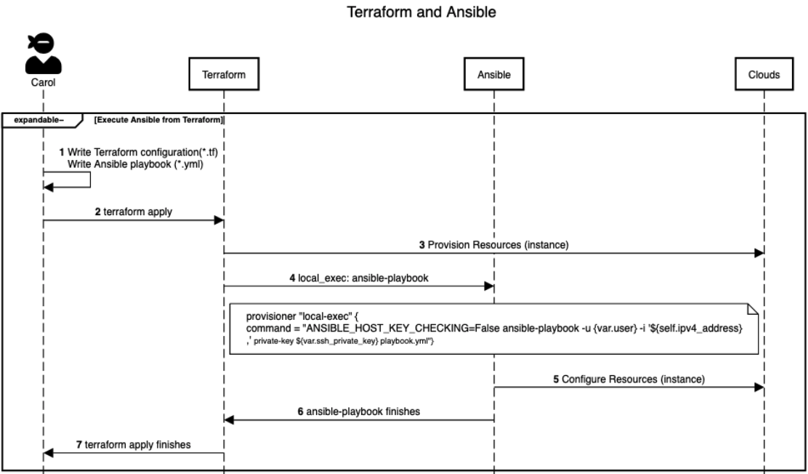

# Terraform and Ansible Demo on AWS

Terraform is an open source software tool that can be used to provision thousands of resources on hundreds of different platforms and services. Terraform code is written in the HashiCorp Config Language or HCL. HCL is easy to learn and easy to troubleshoot. It's meant to strike a balance between human-friendly and machine-readable code.

With Terraform you simply declare resources and how you want them configured, and then Terraform will map out the dependencies and build everything for you.

Ansible is a simple agentless configuration management tool that executes playbooks, which are lists of customizable actions written in YAML on specified target servers. It can perform all bootstrapping operations, like installing and updating software, creating and removing users, and configuring system services. Therefore, it is suitable for bringing up servers you deploy using Terraform, which are created blank by default.

Ansible and Terraform are not competing solutions, because they resolve different phases of infrastructure and software deployment. Terraform allows you to define and create the infrastructure of your system, encompassing the hardware that your applications will run on. Conversely, Ansible configures and deploys software by executing its playbooks on the provided server instances. Running Ansible on the resources Terraform provisioned directly after their creation allows you to make the resources usable for your use case much faster. It also enables easier maintenance and troubleshooting, because all deployed servers will have the same actions applied to them.

In this demo, you will:
* deploy VM Instances using Terraform
* bootstrap the Instances using Ansible
* invoke Ansible directly from Terraform when a resource deploys.
* avoid introducing race conditions by using Terraform’s `remote-exec` and `local-exec` provisioners in your configuration which will ensure that the Instance deployment is fully complete before further setup commences.

